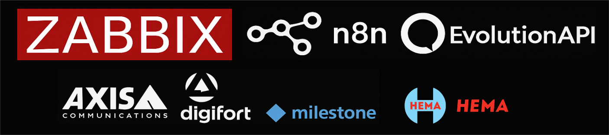
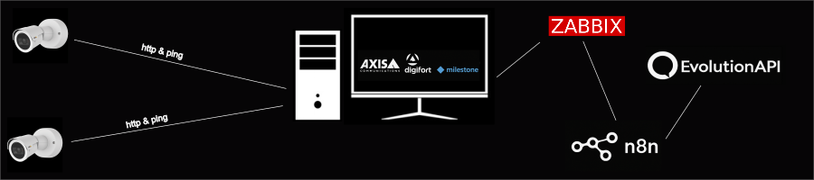

Monitoramento de Câmeras IP com Zabbix + n8n + EvolutionAPI (90 % No-Code)

  

Visão geral:
Uma solução low-code/no-code para monitorar câmeras IP com alertas em tempo real, documentando cada etapa e mudança do fluxo, sem precisar escrever quase nenhum código.

### Objetivo
Monitorar continuamente a disponibilidade e a saúde de câmeras IP, identificando falhas e degradações para disparar alertas automáticos às equipes responsáveis — tudo isso com 90 % de configuração via interface, minimizando scripts e maximizando reuso.

### Arquitetura No-Code

  

Coleta (Zabbix Agent)

No-code: configurações em UserParameters via interface gráfica.

Scripts leves (Bash/Python/cmd/js) isolados apenas para ping e verificação HTTP.

Processamento (Zabbix Server)

Triggers e media types configurados pelo front-end.

Envio de payload JSON ao n8n sem escrever código adicional.

Orquestração (n8n)

- 90 % no-code: montagem de workflows visuais.

- Nós de parsing, enriquecimento e roteamento configurados por drag-and-drop.

- Pequenos trechos de JavaScript apenas quando indispensável (menos de 10% do fluxo).

Alerta (EvolutionAPI)

- Conector REST configurado via interface.

- Envio de notificações a WhatsApp, Telegram, Slack e e-mail.

Opções de resposta automática (por exemplo, cameras off/on) acionadas via nós de “HTTP Request”/“Webhook”.

### Como Funciona Sem Código
- Adição de nova câmera:

- Basta criar um host no Zabbix com os UserParameters pré-definidos.

Ajuste de limiares:

Na interface do Zabbix, edite triggers (tempo de resposta, HTTP 200).

Modificação de fluxo de alerta:

No painel do n8n, arraste novos nós ou ajuste variáveis de ambiente.

Inclusão de canal de notificação:

### Componentes Detalhados

| Componente        | Tecnologia / Versão      | Função                                      |
|-------------------|--------------------------|---------------------------------------------|
| **Zabbix Server** | 6.x                      | Monitoramento centralizado                  |
| **Zabbix Agent**  | 6.x + UserParameters     | Coleta remota com scripts personalizados    |
| **n8n**           | 1.x                      | Orquestração de fluxos                      |
| **EvolutionAPI**  | v2 (interno)             | Entrega de notificações                     |
| **VMs de Câmera** | Windows Server           | Softwares VMS (Digifort, Milestone, ACS)    |

---

<!--
### 📌 Requisitos Futuros (Roadmap)

- [ ] Integração com painel de status em **Grafana**
- [ ] Autenticação de usuários via token JWT
- [ ] Mecanismo de **re-tentativa automática**
- [ ] Histórico de alertas e dashboard de métricas
-->