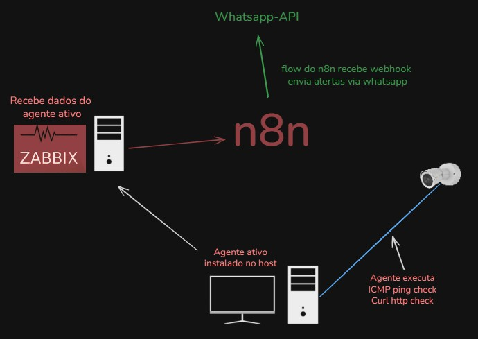

Monitoramento de Câmeras IP com Zabbix + n8n (95 % No-Code)

[](https://wa.me/5515996122003)
[](mailto:jhony.de.almeida@gmail.com)

Visão geral:
Uma solução low-code/no-code para monitorar câmeras IP com alertas em tempo real, documentando cada etapa e mudança do fluxo, sem precisar escrever quase nenhum código.

### Objetivo
- Monitorar continuamente a disponibilidade e a saúde de câmeras IP, identificando falhas e degradações para disparar alertas automáticos às equipes responsáveis.
- configuração via interface, minimizando scripts e maximizando reuso.

### Arquitetura No-Code
<p align="center">  </p>

```
Agente Zabbix Ativo → Servidor Zabbix → Webhook → n8n → WhatsApp API → Usuário
```
- Zabbix Server recebe dados dos agentes ativos.
- Agente executa ICMP ping check e curl http check.
- n8n escuta webhooks do Zabbix.
- n8n envia alertas via WhatsApp API para os operadores.
--- 
### Fluxo de Funcionamento
### 1. Agente Zabbix Ativo
Instalado nos hosts que precisam ser monitorados.
Executa checagens como:
- ICMP (Ping)
- HTTP (via curl ou outras requisições)

### 2. Servidor Zabbix
Recebe os dados dos agentes ativos.
Processa as métricas e aplica triggers de alerta baseadas nas condições configuradas.

### 3. Integração Zabbix → n8n
O Zabbix, ao detectar um problema ou trigger, envia um webhook HTTP para um fluxo criado no n8n.

### 4. n8n Automação
- O fluxo no n8n recebe o webhook do Zabbix contendo os dados do alerta.
- Processa essas informações e envia uma mensagem automaticamente via WhatsApp API, notificando os responsáveis.

### 5. WhatsApp API
Interface para envio das mensagens geradas pelo n8n diretamente para o WhatsApp dos responsáveis.