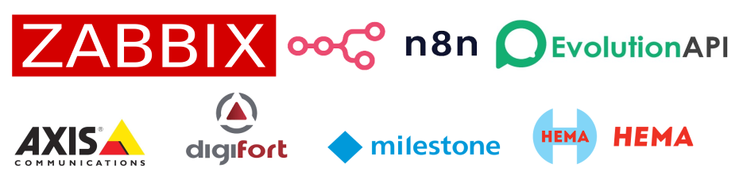

[](https://wa.me/55SEUNUMERO)
<p align="center">
  
</p>


## 📡 Zabbix 
## 📸 Monitoramento de Câmeras IP com Zabbix + n8n + EvolutionAPI

Automatize o monitoramento de câmeras IP e receba alertas em tempo real por meio de uma integração eficiente entre:

- 🖥️ **Zabbix** – Monitoramento de infraestrutura
- 🔧 **n8n** – Orquestração e automação de fluxos
- 📲 **EvolutionAPI** – API para envio de notificações

---

### 🎯 Objetivo

Monitorar continuamente a disponibilidade e desempenho das câmeras IP, identificando falhas ou degradações e disparando alertas automáticos para as equipes responsáveis.

---

### 🏗 Arquitetura Geral

```text
[Câmeras IP] ────► [Zabbix Agent (UserParameter)] ──► [Zabbix Server (VPS)]
      │                                               │
      │                                               ▼
      │                                        [Media Type JSON]
      │                                               │
      │                                               ▼
      └────────────────────────────────────────► [n8n Workflow]
                                                      │
                                                      ▼
                                              [EvolutionAPI / Bot]
```

> ✅ Uma imagem dessa arquitetura também está disponível em `docs/fluxo.png`.

---

### ⚙️ Componentes e Fluxo Detalhado

#### 1. **Câmeras IP**  
Dispositivos distribuídos em diferentes locais, monitorados por agentes Zabbix instalados próximos (em OS.Windows).

#### 2. **Zabbix Agent**  
UserParameters configurados para:
- `ping`: Verifica conectividade e latência
- `http`: Verifica status da interface web da câmera

🕒 Coleta realizada a cada **1 minuto**.

#### 3. **Zabbix Server (VPS)**  
- Centraliza os dados dos agentes
- Define **triggers** para falhas ou degradações
- Envia alertas via **Media Type JSON** para o n8n

#### 4. **n8n (Workflow Engine)**  
- Recebe o webhook com dados JSON
- Realiza parsing, enriquecimento e roteamento dos dados
- Dispara alertas para a **EvolutionAPI** ou bots personalizados

#### 5. **EvolutionAPI / Bot**  
- Envia notificações para canais como WhatsApp, Telegram, Slack ou e-mail
- Pode acionar **respostas automatizadas** (ex: reinício de serviços)

---

### 🛠️ Tecnologias e Infraestrutura

- **Zabbix Server:** v6.x – Motor de monitoramento
- **Zabbix Agent:** v6.x – Com `UserParameter` para scripts customizados
- **n8n:** v1.x – Plataforma low-code para automações
- **EvolutionAPI:** v2 – API RESTful para envio de alertas
- **Linguagens:** Python / Bash / JSON – Para coleta, parsing e envio
- **Infraestrutura:** VPS Linux (Ubuntu 22.04)
- **VMs de Câmeras:** Windows Server com:
 
  - Digifort
  - Milestone
  - Axis Camera Station (ACS)

| Componente        | Tecnologia / Versão      | Função                                      |
|-------------------|--------------------------|---------------------------------------------|
| **Zabbix Server** | 6.x                      | Monitoramento centralizado                  |
| **Zabbix Agent**  | 6.x + UserParameters     | Coleta remota com scripts personalizados    |
| **n8n**           | 1.x                      | Orquestração de fluxos                      |
| **EvolutionAPI**  | v2 (interno)             | Entrega de notificações                     |
| **VMs de Câmera** | Windows Server           | Softwares VMS (Digifort, Milestone, ACS)    |
| **Scripts**       | Python / Bash / JSON     | Utilizados para coleta e envio de dados     |

---

### 📌 Requisitos Futuros (Roadmap)

- [ ] Integração com painel de status em **Grafana**
- [ ] Autenticação de usuários via token JWT
- [ ] Mecanismo de **re-tentativa automática**
- [ ] Histórico de alertas e dashboard de métricas
